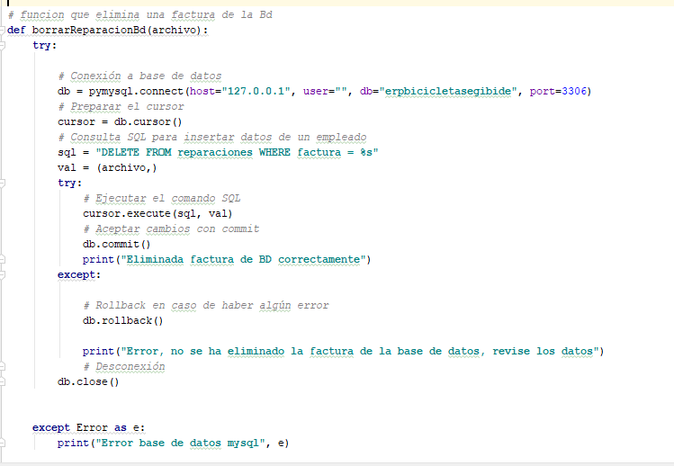

# Manual de usuario

Este manual de usuario está redactado para entender el funcionamiento del proyecto Práctica3 departamentos.

## Objetivo de la práctica

El objetivo del proyecto es simular el funcionamiento interno de un sistema de gestión empresarial
(ERP) creando un proyecto con el entorno de desarrollo `Pycharm` y utilizando el lenguaje de programación 
`Python 3.7`
Como requerimiento de la práctica se debe trabajar la siguiente materia:
- Creación de una base de datos en Mysql donde se guarde toda la imformación de la empresa.
- Relación entre las tablas de los departamentos.
- Persistencia de datos usando diferentes tipos de archivos.
- Trabajar Strings, Ficheros, Excepciones, Funciones, Listas y Diccionarios.
- Generar las operaciones CRUD de toda base de datos.
- Funcianiemto correcto del programa.

## Estructura

Teniendo en cuenta los requerimientos de la práctica se ha realizado la siguiente estructura:

- [Base de datos Mysql](#Base-de-datos)
- [Directorio de carpetas](#Directorio-de-carpetas)
- [Archivos Pdf](#Persistencia-de-datos-con-archivos-Pdf) 
- [Operaciones CRUD](#Operacione-CRUD)
- [Documentación](#Documentación)

### Base de datos

 
### Directorio de carpetas
    

### Persistencia de datos con archivos Pdf

Como novedad en esta práctica respecto a la anterior, he insistido bastante en el trabajo con archivos Pdf por lo que he
utlizado las librerías ***`PyPdf2`*** y ***`Fpdf`***

### Operaciones CRUD

- Create:

- Insert:

- Read:

- Delete:

## Ejecutar el proyecto

Para poner en funcionamiento el proyecto descargar este repositorio a local, abrir en `PyCharm` de la carpeta
del repositorio `departamentos-RP-master` la carpeta de proyecto ***Practica3_departamentosbd***.
Una vez abierto el proyecto abrir ***test.py*** a dar a la opción `Run test.py`.

## Credenciales de usuario

Con la función `sistema_erp()` se inicializa todo el programa. Ésta es la que gestiona todo el 
funcionamiento interno del mismo a través de llamadas a otras funciones  que tienen funcionalidades
específicas, e interactuando con diferentes directorios y archivos.

Al iniciarse el programa se visualizará el menú principal que muestra los departamentos disponible.
Para acceder a ellos se puede entrar con cualquier usuario resgistrado en la Bd.
No obstante entrar con el ***usuario `admin`*** y ***contraseña `admin`*** para acceder al departamento de administración
y para el resto de departamentos habrá que introducir como usuario y password el departamento e indicarle qué opción de 
departamento es.

## Materia trabajada

## Documentación

- [Manejo de archivos y directorios en python](https://ricardogeek.com/manejo-de-archivos-y-directorios-en-python/)

- [Python Software Foundation - Pure Python MySQL Driver](https://pypi.org/project/PyMySQL/)

- [Crear documentos PDF en Python con ReportLab](https://recursospython.com/guias-y-manuales/crear-documentos-pdf-en-python-con-reportlab/)

- [Negrita python](https://stackoverflow.com/questions/8924173/how-do-i-print-bold-text-in-python)

- [Python 3.7.2 documentation](https://docs.python.org/3/)

- [Maria DB Foundation](https://mariadb.org/mariadb-innodb-foreign-key-constraint-errors/)

- [PyPdf2 Documentation](https://pythonhosted.org/PyPDF2/)

- [Fpdf](https://pypi.org/project/fpdf/)

## Conclusión

Este manual está creado como orientación para la correcta utilización del programa. Como se ha
podido leer se encarga de simular el flujo de información en un sistema de gestión empresarial utilizando base de datos
y archivos.

Para más detalle se recomienda ver los siguientes vídeos tutorial.

## Video tutorial del funcionamiento del programa

[Vídeo tutorial funcionamiento programa y generación de facturas](https://www.youtube.com/watch?v=vnU04C6NoTg&feature=youtu.be)

[Vídeo tutorial funcionamiento de la base de datos](https://youtu.be/ZZ28fj-F_k0)